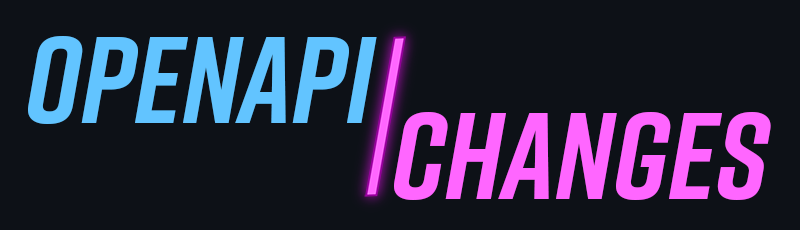

[](https://discord.gg/x7VACVuEGP)
[](https://github.com/pb33f/openapi-changes/releases)
[](https://www.npmjs.com/package/@pb33f/openapi-changes)
[](https://hub.docker.com/r/pb33f/openapi-changes)

# OpenAPI Changes

## The world's **_most powerful and complete_** OpenAPI diff tool.

`openapi-changes` lets you inspect what changed in an OpenAPI specification between two files, 
across local git history, or directly from a GitHub-hosted file URL.

It can render the same semantic change model as:

- an interactive terminal UI
- a terminal summary
- a machine-readable JSON report
- a markdown report
- a self-contained offline HTML report

It works well for local exploration, CI/CD checks, release notes, and API review workflows.

## How is it the 'most powerful and complete?'?

openapi-changes gives you the power to view all changes between two OpenAPI contracts, and over time in every which
way you can possibly think of. Graphs, trees, lists, diffs, JSON, mark down.

Has no network dependencies at all. Runs 100% offline, including the HTML report.

---

## Install with Homebrew

```bash
brew install pb33f/taps/openapi-changes
```

## Install with npm or yarn

```bash
npm i -g @pb33f/openapi-changes
```

If you prefer yarn:

```bash
yarn global add @pb33f/openapi-changes
```

## Install with cURL

```bash
curl -fsSL https://pb33f.io/openapi-changes/install.sh | sh
```

## Install or run with Docker

```bash
docker pull pb33f/openapi-changes
```

Docker images are available for both `linux/amd64` and `linux/arm64`.

To run a command, mount the current working directory into the container:

```bash
docker run --rm -v $PWD:/work:rw pb33f/openapi-changes summary . sample-specs/petstorev3.json
```

To run the interactive `console` through Docker, allocate a TTY with `-it`:

```bash
docker run --rm -it -v $PWD:/work:rw pb33f/openapi-changes console . path/to/openapi.yaml
```


---

### Summary view

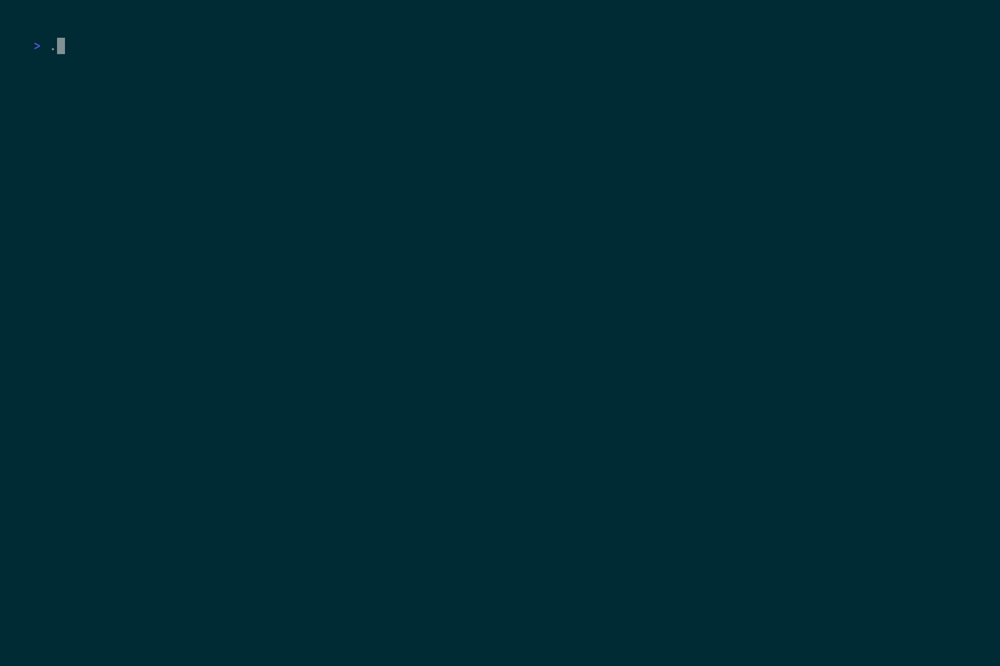


### A full terminal UI

Comes in multiple themes! PB33F (Dark), Roger Mode (Light) and Tektronix (Retro Dark)

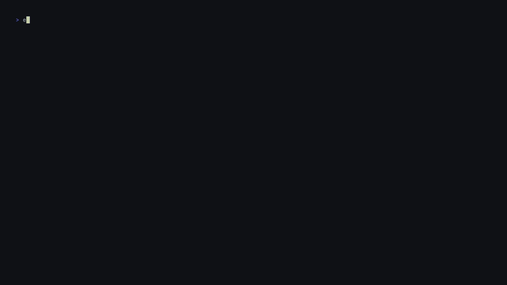


### Powerful HTML report with no rival.

A self-contained, offline HTML report with interactive timeline, change explorer graph, diff views, and more.

#### Timeline overview with change history chart

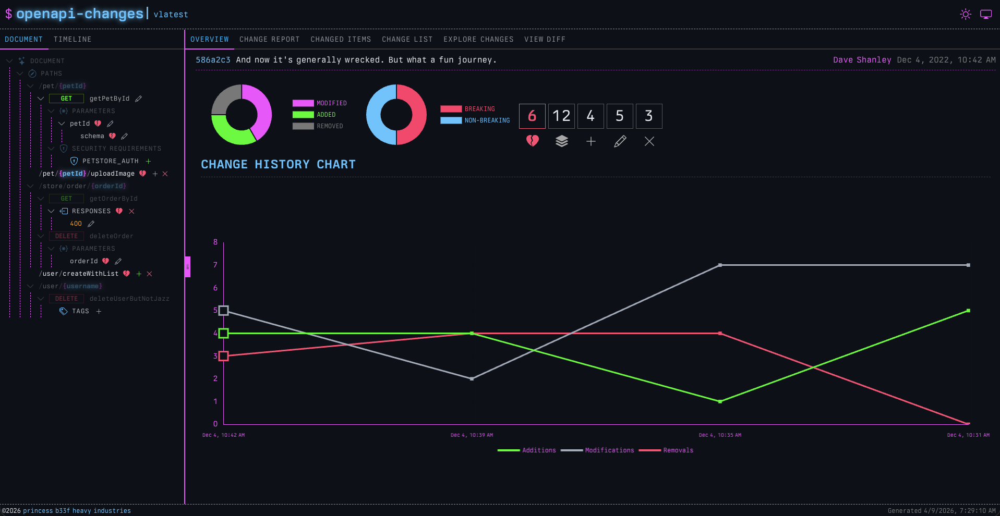

#### Interactive explorer graph

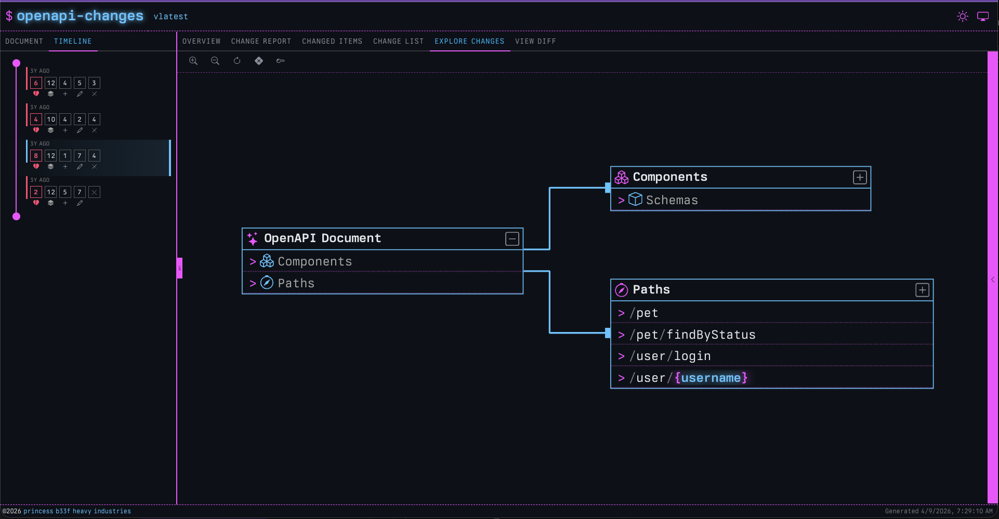

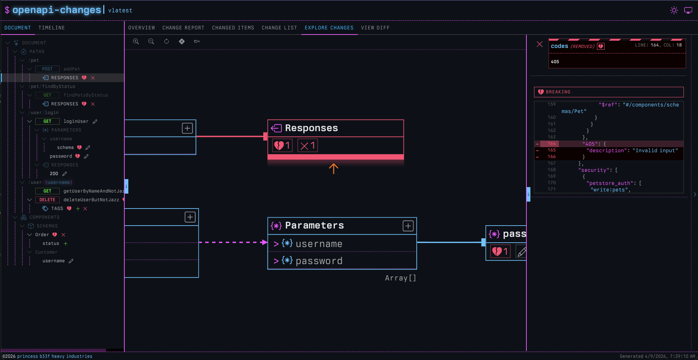

#### Change report breakdown

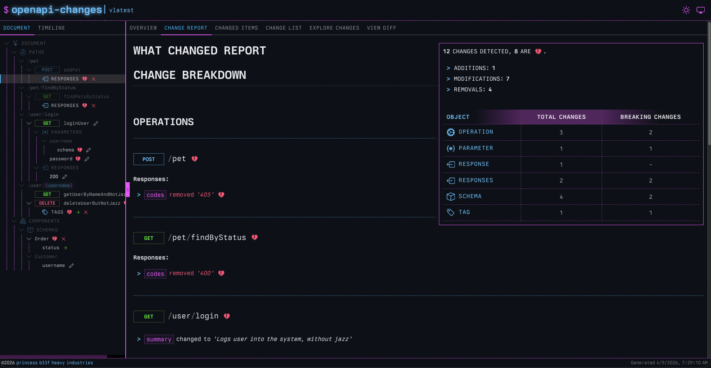

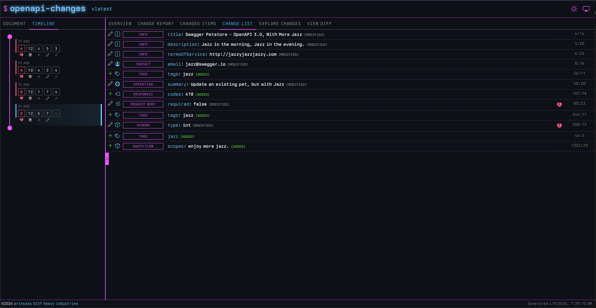

#### Side by side, focused, unified or inline diffing

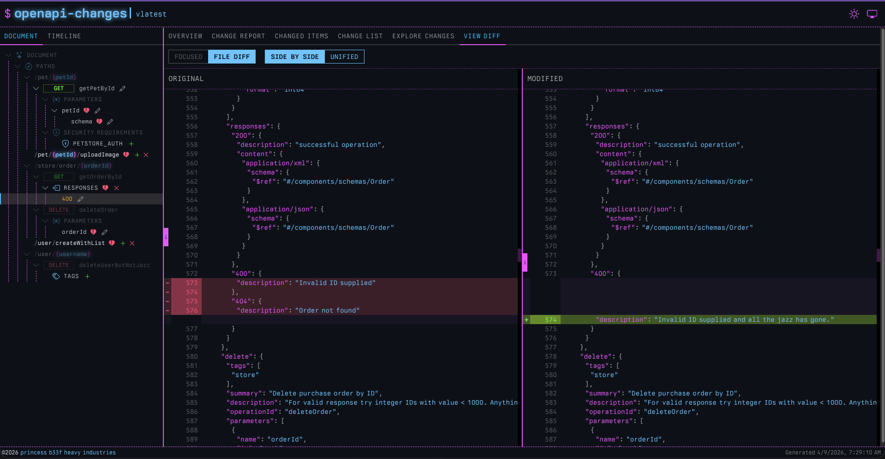

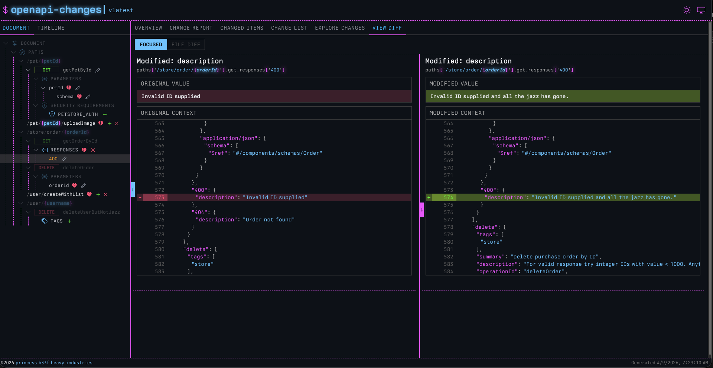

#### Roger mode (monochrome light theme)

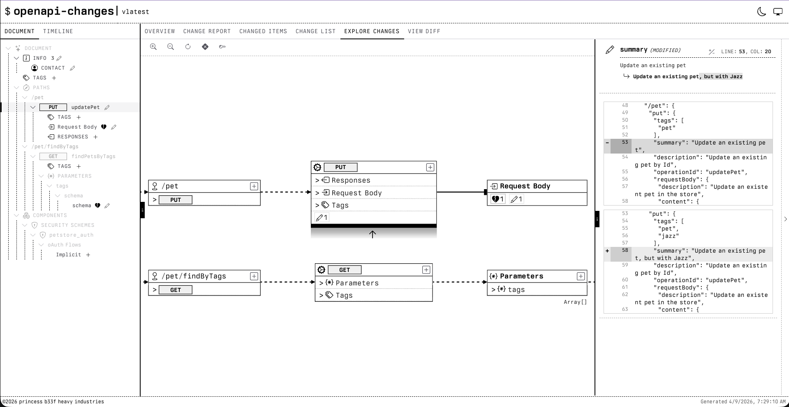

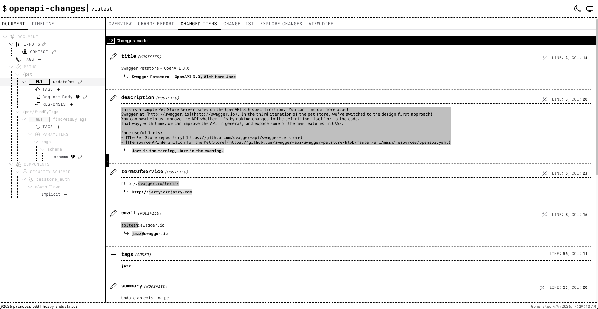

#### Tektronix mode (green monochrome)

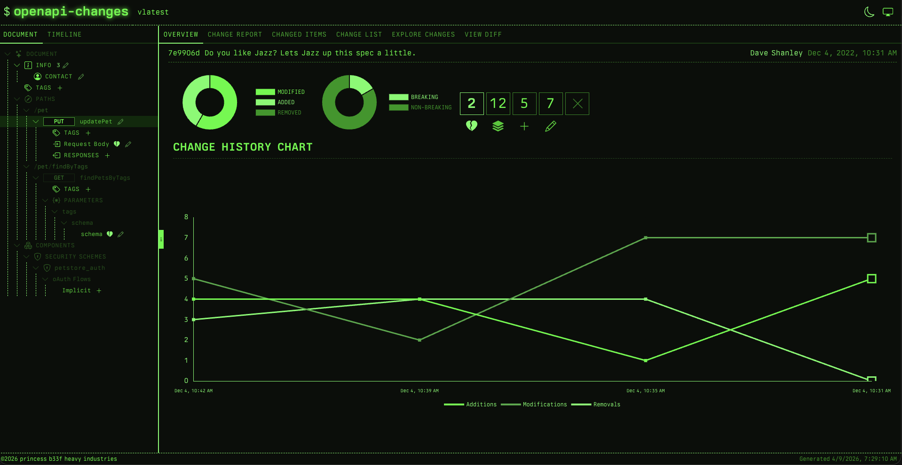

---

## Documentation

### [Quick Start Guide 🚀](https://pb33f.io/openapi-changes/quickstart/)

Full docs: https://pb33f.io/openapi-changes/

- [Installing openapi-changes](https://pb33f.io/openapi-changes/installing/)
- [Configuring breaking changes](https://pb33f.io/openapi-changes/configuring/)
- [Command arguments](https://pb33f.io/openapi-changes/command-arguments/)
- Commands:
  - [`console`](https://pb33f.io/openapi-changes/console/)
  - [`summary`](https://pb33f.io/openapi-changes/summary/)
  - [`report`](https://pb33f.io/openapi-changes/report/)
  - [`markdown-report`](https://pb33f.io/openapi-changes/markdown-report/)
  - [`html-report`](https://pb33f.io/openapi-changes/html-report/)
  - [`completion`](https://pb33f.io/openapi-changes/completion/)
- [About openapi-changes](https://pb33f.io/openapi-changes/about/)

---

## Build from source

`openapi-changes` currently requires Go `1.25.0`.

```bash
git clone https://github.com/pb33f/openapi-changes.git
cd openapi-changes
go build -o bin/openapi-changes .
```

Or use `make`:

```bash
make
```

---

## Command overview

The current command surface is:

- `console` for the interactive terminal UI
- `summary` for fast terminal and CI output
- `report` for machine-readable JSON
- `markdown-report` for shareable markdown output
- `html-report` for the interactive offline browser report
- `completion` for shell completion scripts

Run `openapi-changes --help` or `openapi-changes <command> --help` for the live CLI surface.

### Terminal themes

The terminal-facing commands support multiple presentation modes:

- `--no-color` for the light Roger monochrome theme
- `--roger-mode` as an alias for `--no-color`
- `--tektronix` for the green monochrome terminal theme

See the [command arguments docs](https://pb33f.io/openapi-changes/command-arguments/) for the full shared flag set.

---

## Custom breaking rules configuration

`openapi-changes` supports configurable breaking-change rules via `changes-rules.yaml`.

### Use an explicit config file

```bash
openapi-changes summary -c my-rules.yaml old.yaml new.yaml
```

### Or let it auto-discover the default config file

```bash
openapi-changes summary old.yaml new.yaml
```

Default lookup locations:

1. `./changes-rules.yaml`
2. `~/.config/changes-rules.yaml`

### Example

```yaml
pathItem:
  get:
    removed: false
  post:
    removed: false
  put:
    removed: false
  delete:
    removed: false

schema:
  enum:
    removed: false

parameter:
  required:
    modified: false
```

Each rule supports:

- `added`
- `modified`
- `removed`

For the full rules reference and more examples, see the
[configuration docs](https://pb33f.io/openapi-changes/configuring/).

---

See the full docs at https://pb33f.io/openapi-changes/
